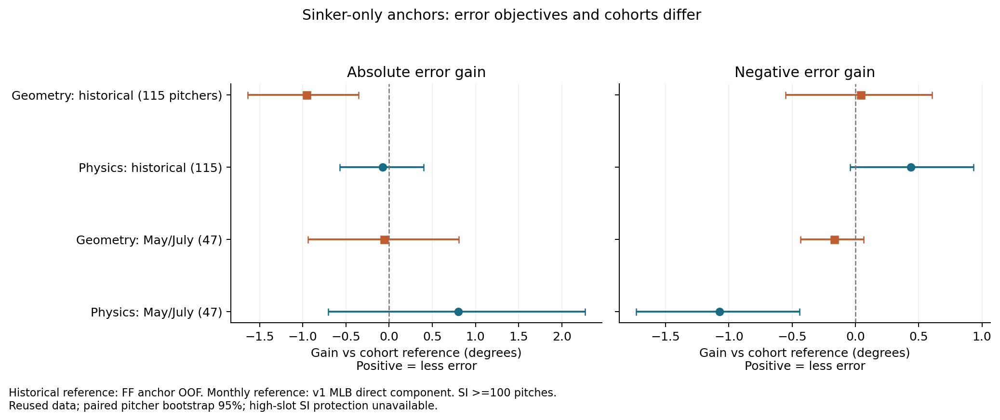
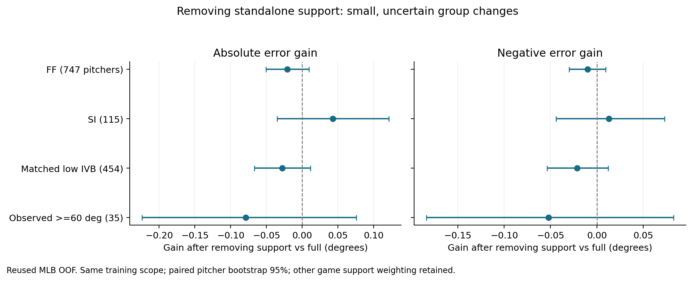
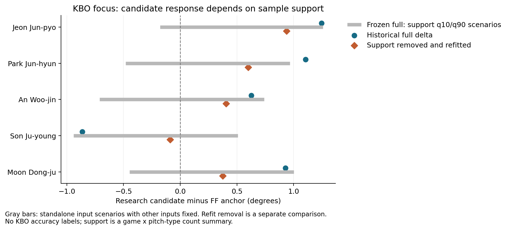

# 싱커 앵커·표본 지원값 연구와 검토 창구

사용자가 요청한 1–2단계를 실행했다. **싱커 입력만 쓰는 앵커는 편향을 줄여도 MAE와 음의 오차를 함께 안정적으로 개선하지 못했고, 표본 지원값 제거도 집단 오차 개선이 작고 불확실했다.** 운영 v3·참고 범위는 유지했다. APR/ZA와 같은 eAA 전용 협업 창구를 GitHub draft PR [#69](https://github.com/seoyeonwoo1223/KBO-Savant-Visual-Project/pull/69)에 개설했다.

실험 ID는 EAA-SI1/EAA-SUP1이다. [gates.md](gates.md)를 `542701aff957155e07899fa24c824845f11cb9e1`로 먼저 커밋·푸시하고, 코드·입력은 `b75a1510506d4c26d572cd619a782db3f260144a`에 기록한 뒤 계산했다. [실행 전 잠금](experiment-lock.json)은 코드·입력 SHA를 보존한다. 이번 기준은 싱커 우선이라는 새 범위의 사전 진단이며, 과거 R1/R2 실패 판정과 조건을 소급 변경하지 않았다.

## 싱커 입력만 쓰는 앵커

싱커 주구종·싱커100구 이상·유한 입력으로 과거 MLB 198시즌/115명을 사용했다. 기존5outer fold를 유지하고 각fold의 싱커 행만 학습했다. 같은 투수의 모든 시즌을 분리했으며, 월 예측에서도 과거의 같은 투수는 해당fold 모델을 사용했다. 월은 학습에 넣지 않았다. 두 고정 대조는 신장·손·싱커 높이/수평의 기하4열, 여기에 싱커 구속·IVB·HB를 더한 물리7열이다. α100·2차 다항·학습fold 가중 표준화와 투수 노출 가중을 고정했다.

오차는 예측−관측, 음의 오차량은 `max(관측−예측,0)`이다. 투수 안에서 시즌/월별 오차를 평균하고 투수를 동일 가중한다. 단위는 °다.

| 과거 SI OOF / 115명 | MAE | 평균오차 | 음의 오차량 |
|---|---:|---:|---:|
| 기존 포심 앵커 | 3.659 | −1.036 | 2.347 |
| 싱커 기하4열 | 4.616 | +0.008 | 2.304 |
| 싱커 물리7열 | 3.736 | −0.086 | 1.911 |

물리7열은 평균편향을 줄였지만 MAE0.10° 개선 조건을 실패했다. MAE 개선량은 `−0.077° [−0.571,+0.397]`, 음의 오차 개선량은 `+0.436° [−0.043,+0.933]`다. 기하4열은 평균오차가 거의0이어도 MAE가 크게 악화했다. 이 결과는 평균편향만으로 후보를 평가하면 안 된다는 사례다.

| 재사용5·7월 SI100 / 63투수월·47명 | MAE | 평균오차 | 음의 오차량 |
|---|---:|---:|---:|
| 기존 v1 MLB 직접 성분 | 5.098 | +3.876 | 0.611 |
| 싱커 기하4열 | 5.154 | +3.596 | 0.779 |
| 싱커 물리7열 | 4.295 | +0.924 | 1.685 |

월 물리7열의 MAE 개선량은 `+0.804° [−0.703,+2.269]`로 불확실했고, 음의 오차량은 **1.074° 증가**, 증가 구간은 `[+0.443,+1.733]°`였다. 평균 MAE 감소와 저평가 보호는 동시에 성립하지 않았다. 이 표의 기준은 실제 MLB 릴리즈를 입력한 v1 직접 성분이며 KBO bridge 전체가 아니다. 월63행 중61행이 포심100구 미만이다. 과거 포심 앵커 기준과 월 직접 성분 기준을 같은 추정 경로의 성과로 합치지 않는다.



새 입력에는 포심이 없지만 **과거 학습 캐시 자체는 FF100 모집단**이다. 포심 부족형의 학습 대표성 문제는 남아 있다. 월은 과거와 다른 집계 기간이며, 라벨95% 조건을 요구했다. 과거는 기존 공식 시즌 평균 라벨을 사용해 월의 유효 투구 평균 라벨과 관측 범위가 같지 않다. 기존 v1 기준의 전체 학습·평가 투수 분리까지 입증한 것도 아니다.

과거 SI와 월 SI 표본에는 관측60° 이상이0명이어서 사전 고슬롯 보호 조건은 판정 불가다. 추가 변수 탐색·튜닝·블렌딩·모형 선택은 하지 않았다. 원래 자료에서 수행한 낮은IVB 조건과 전체 세부값은 [사전 정의](gates.md), [진단 조건](sinker_diagnostic_gates.json), [과거 지표](MLB_OOF_reused_sinker_metrics.csv), [월 지표](MayJuly2025_reused_sinker_metrics.csv)에 있다.

KBO 캐시에서는 SI100 기준21명, 그중 포심 부족17명에 연구값을 계산했다. 기하4열은21명, 물리7열은19명이 과거 학습 입력의 축별 최소·최대 안이었다. 물리7열의 범위 밖2명은 raw 값만 보관하고 지지영역 내 연구값은 비웠다. 축별 범위 안이라는 상태는 공동 지지나 KBO 정확도 검증이 아니다. 학습에는 KBO 참고각도를 사용하지 않았고 운영값을 교체하지 않았다. [KBO 연구값·지원 플래그](KBO2026_sinker_research.csv)에 분모와 초과 변수가 있다.

## standalone 표본 지원값

과거 R2 full의 입력·학습·5outer/3inner fold·λ1·α300·직교 투영·cap5를 재현했다. `game_pair_support` 한 열만 제거한 재적합, 학습fold 중앙값으로 고정한 재적합, 고정 full 모델의 학습10/50/90백분위 입력 시나리오를 비교했다. 다른 경기 관계에 걸린 지원 가중은 유지했다. FC/OTHER 학습은 역사 대조 재현 맥락이며 새 커터 경로를 설계·최적화한 것이 아니다.

| 재사용 OOF | full MAE → 제거 MAE | full 음의 오차 → 제거 음의 오차 |
|---|---:|---:|
| 포심747명 | 3.945 → 3.966 | 1.723 → 1.733 |
| 싱커115명 | 3.554 → 3.511 | 1.725 → 1.712 |
| 기존 낮은IVB454명 | 3.651 → 3.679 | 2.564 → 2.585 |
| 고슬롯35명 | 5.641 → 5.721 | 4.924 → 4.976 |

싱커 MAE 개선은0.043°이며 paired95%구간 `[-0.035,+0.121]°`, 음의 오차 개선은0.013°이고 구간 `[-0.044,+0.073]°`로 모두0을 포함했다. 포심·낮은IVB·고슬롯은 점 추정상 악화했다. 단일 지원값을 빼면 안정적인 정확도 개선이 생긴다는 근거는 확보하지 못했다. 중앙값 상수 재적합은 직교 투영에서 상수열이 제거되어 단일 열 제거와 수치적으로 일치했다.



관심5명은 모두 포심 주구종이므로 싱커 앵커를 강제 적용하지 않았다. 아래는 기존 포심 앵커 대비 R2 연구 후보 변화이며 실제 KBO 오차 개선이 아니다.

| 선수 | full 보정 | 지원값 제거 후 재적합 보정 |
|---|---:|---:|
| 전준표 | +1.246 | +0.937 |
| 박준현 | +1.104 | +0.600 |
| 안우진 | +0.626 | +0.405 |
| 손주영 | −0.865 | −0.089 |
| 문동주 | +0.928 | +0.374 |

손주영의 하락과 문동주의 상승이 크게 줄었다. 고정 full의 지원값10/90백분위 시나리오에서는 여러 선수의 보정 부호가 달라졌다. **후보 반응의 지원값 의존성은 확인했지만 실제 정확도 개선이나 지원값의 인과효과를 입증한 것은 아니다.** 지원값은 경기×구종의 n에 대한 `(n−1)/(n+4)`의 투구별 평균이다. 표본·구종 구성·직교 투영과 연결된 값이며 동작 관측이 아니다. 재적합 결과와 고정모델 입력 민감도는 별개로 해석한다.



회색선은 고정모델의 입력 시나리오이며 오차 구간으로 쓰지 않는다. [5명 상세 대조](KBO_focus_support.csv), [모든 집단 지표](MLB_OOF_reused_support_metrics.csv), [paired 구간](MLB_OOF_reused_support_scores.json), [fold별 결과](support_fold_metrics.csv)에 근거가 있다. bootstrap은 고정 예측의 투수 재표집이며 재학습·다중 비교·리그 전이 불확실성을 포함하지 않는다.

## 검증과 재현

[verification.json](verification.json)에서 점 통계2,154개·paired값/구간2,420개·독립 정상방정식 싱커 회귀12개를 검산했다. 단위 테스트4개가 통과했다. 이전 연구264개 파일 및 운영v1/v3 SHA를 보존했고 과거 R2 재현 최대차는7.50e−12°다. 별도 깨끗한 연구 worktree에서 과거 로컬 연구 폴더 없이8개 예측표·3,025행이 정확히 재현됐다([portable_reproduction.json](portable_reproduction.json)). 같은 결과를 새 확증으로 세지 않는다.

입력과 라벨은 [inputs/source_manifest.json](inputs/source_manifest.json)에 연결된다. `frozen_helpers.zip`은 확보된 코드 원판의 사본이며, 모델 실행 시 SHA를 확인하고 임시 폴더에서 기존 private helper를 불러온다. 전체 원본 ZIP이나 전체 과거 MLB 투구 자료가 아니다. 2024 및2025년5·6·7·8·9월은 모두 재사용이다. KBO 입력은 기존10월4일 마감 캐시이며 최신 master 전체 원문을 확인했다고 주장하지 않는다.

```bash
python -m pip install -r analysis/arm_angle/sinker_anchor_20261007/requirements-research.txt
python analysis/arm_angle/sinker_anchor_20261007/record_manifest.py --verify
OMP_NUM_THREADS=2 OPENBLAS_NUM_THREADS=2 python analysis/arm_angle/sinker_anchor_20261007/run_sinker.py
OMP_NUM_THREADS=2 OPENBLAS_NUM_THREADS=2 python analysis/arm_angle/sinker_anchor_20261007/run_support.py
OMP_NUM_THREADS=2 OPENBLAS_NUM_THREADS=2 python analysis/arm_angle/sinker_anchor_20261007/verify.py
python -m pytest analysis/arm_angle/sinker_anchor_20261007/test_methodology.py -q
python analysis/arm_angle/sinker_anchor_20261007/presentation.py
```

기본 재현은 커밋된 입력·라벨 사본만 사용한다. `prepare_inputs.py`는 원래 인계·이전 연구 폴더를 실제 확보했을 때만 입력 계보를 다시 만드는 선택 단계다. 기본 재현에 누락된 과거 원문을 다운로드하거나 이전 연구를 재빌드할 필요는 없다. [환경](environment.json), [결과 SHA](RESULTS-MANIFEST.json), [검산 코드](verify.py)를 함께 남겼다.

SHA 검사는 재실행 **전**에 전달 파일의 무결성을 확인한다. 재실행한 worktree에서는 모델 직렬화·환경에 따른 산출물과 `verification.json`의 실제 확보한 이전 파일 수가 달라질 수 있으므로, 재생성된 모든 파일이 원래 결과 manifest와 바이트까지 같다고 요구하지 않는다. 이전 연구 폴더가 없으면 그 SHA 검사는 건너뛰고0건으로 기록한다. 이때도 잠긴 코드·입력, 운영 모델, 분할·회귀·지표 검산은 실행한다. 예측표 재현 확인은 원래 비교 기록과 구분한다.

## 소통 창구

[draft PR #69](https://github.com/seoyeonwoo1223/KBO-Savant-Visual-Project/pull/69)의 `collab/eaa-claude-gpt` 브랜치에 메시지·현황·규칙·검사를 두었다. APR/ZA 창구와 기존 작업 파일은 보존했다. 등록 메시지0001에 이어 결과·검토 요청을 새 메시지로 남긴다. 실제 Claude 응답은 아직 없으며, 상대 답변을 대신 작성하지 않았다. 채택·운영 변경·병합은 하지 않았다.

전달 한 줄: **“eAA 협업 창구(collab/eaa-claude-gpt) 확인하고 차례면 답해줘. 처음이면 collab/prompts/claude-start.md부터.”**

PR 생성 후 자동 구독은 GitHub 권한403 때문에 해제하지 못했다. 예약·모니터링은 만들지 않았으며 GitHub 화면의 Unsubscribe 처리가 필요하다. 메시지와 연구 브랜치의 읽기·쓰기는 가능하다.
